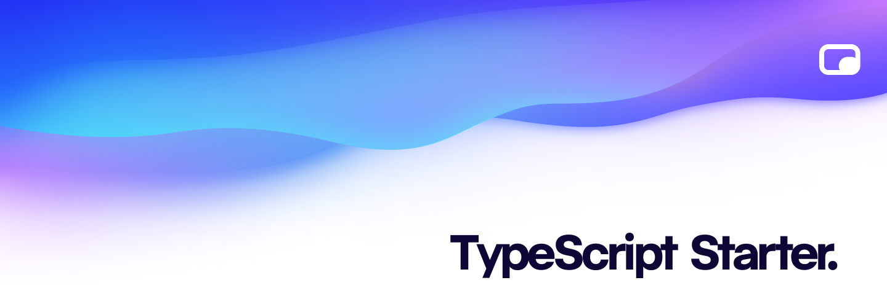

<p align="center"></p>

[![npm version][npm-version-src]][npm-version-href]
[![GitHub Actions][github-actions-src]][github-actions-href]
[](http://commitizen.github.io/cz-cli/)
<!-- [![npm downloads][npm-downloads-src]][npm-downloads-href] -->
<!-- [![Codecov][codecov-src]][codecov-href] -->

# The Simple Way

This is an opinionated TypeScript Starter kit to help kick-start development of your next Bun package.

## 💡 Get Started

Luckily, it's incredibly easy to get your package development started:

```bash
# you may use this GitHub template or the following command:
bunx degit stacksjs/ts-starter my-pkg
cd my-pkg

 # if you don't have pnpm installed, run `npm i -g pnpm`
bun i # install all deps
bun run build # builds the library for production-ready use

# how to create a git commit?
git add . # select the changes you want to commit
bun run commit # then simply answer the questions

# after you have successfully committed, you may create a "release"
bun run release # automates git commits, versioning, and changelog generations
```

### Developer Experience (DX)

This Starter Kit comes pre-configured with the following:

- [Powerful Build Engine](https://github.com/unjs/unbuild) - via unbuild
- [Fully Typed APIs](https://www.typescriptlang.org/) - via TypeScript 5.1
- [Be a Good Commitizen](https://www.npmjs.com/package/git-cz) - pre-configured Commitizen & git-cz setup to simplify semantic git commits, versioning, and changelog generations
- [Built With Testing In Mind](https://bun.sh/docs/cli/test) - pre-configured unit-testing powered by [Bun](https://bun.sh/docs/cli/test)
- [Renovate](https://renovatebot.com/) - optimized & automated PR dependency updates
- [GitHub Actions](https://github.com/features/actions) - runs your CI _(fixes code style issues, tags releases & creates its changelogs, runs the test suite, etc.)_

## 🧪 Testing

```bash
bun test
```

## 📈 Changelog

Please see our [releases](https://github.com/meemalabs/ts-starter/releases) page for more information on what has changed recently.

## 💪🏼 Contributing

Please see [CONTRIBUTING](.github/CONTRIBUTING.md) for details.

## 🏝 Community

For help, discussion about best practices, or any other conversation that would benefit from being searchable:

[Discussions on GitHub](https://github.com/stacksjs/ts-starter/discussions)

For casual chit-chat with others using this package:

[Join the Stacks Discord Server](https://discord.gg/stacksjs)

## 📄 License

The MIT License (MIT). Please see [LICENSE](LICENSE.md) for more information.

Made with ❤️

<!-- Badges -->
[npm-version-src]: https://img.shields.io/npm/v/@stacksjs/dummy-bun-ts-pkg?style=flat-square
[npm-version-href]: https://npmjs.com/package/@stacksjs/dummy-bun-ts-pkg
[npm-downloads-src]: https://img.shields.io/npm/dm/@stacksjs/dummy-bun-ts-pkg?style=flat-square
[npm-downloads-href]: https://npmjs.com/package/@stacksjs/dummy-bun-ts-pkg
[github-actions-src]: https://img.shields.io/github/workflow/status/stacksjs/bun-ts-starter/CI/main?style=flat-square
[github-actions-href]: https://github.com/stacksjs/bun-ts-starter/actions?query=workflow%3Aci

<!-- [codecov-src]: https://img.shields.io/codecov/c/gh/stacksjs/bun-ts-starter/main?style=flat-square
[codecov-href]: https://codecov.io/gh/stacksjs/bun-ts-starter -->
